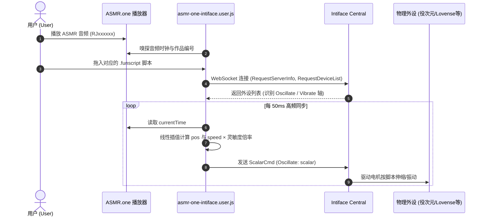

# 🎧 ASMR.one Intiface & Funscript Sync Suite

为 **ASMR.one (Kikoeru)** 打造的互动外设与脚本同步全套解决方案，包含**网页端油猴增强脚本**与**本地离线独立音视频播放器**。

---

## 🌟 核心特性 (Features)

### 1. 网页端油猴脚本 (`asmr-one-intiface.user.js`)
* 🔍 **智能 RJ 嗅探 & EroScripts 联动**：
  * 自动监听当前网页正在播放的音声作品（支持 `RJxxxxxx` / `VJxxxxxx`）。
  * 一键直达 EroScripts 脚本库检索对应的 `.funscript` 振动/抽动脚本。
* 🎮 **Intiface Central / Buttplug.io 直连**：
  * 浏览器直接通过 WebSocket (`ws://127.0.0.1:12345`) 连接本地 Intiface Central。
  * **精准驱动役次元等抽动设备**：针对活塞伸缩设备自动匹配 `ActuatorType: "Oscillate"` 特性，告别震动指令无法抽动的尴尬。
* ⚡ **高精度亚毫秒级同步引擎**：
  * 动态捕获 `<audio>` / `<video>` 播放进度与暂停/跳转事件。
  * 实时线性插值（Linear Interpolation）与速度微分计算，瞬时动作无缝衔接。
* 🎚️ **0% ~ 200% 动态灵敏度调节**：
  * **`0%`**：一键强制静止（静音/防突发防打扰模式）；
  * **`100%`**：标准原速输出；
  * **`200%`**：双倍狂暴爆发输出。
* 🪟 **现代化悬浮交互面板**：
  * 支持自由拖动、记忆悬浮位置、一键折叠为微型状态胶囊。
  * 支持将本地 `.funscript` 直接拖入悬浮窗秒速加载。

---

### 2. 本地独立网页播放器 (`web-player/index.html`)
适合播放已下载到本地的 ASMR 音频、视频与脚本：
* 📁 **零后端依赖**：纯前端 HTML5 + Web Audio 实现，双击即可在任何现代浏览器中运行。
* 📜 **全格式字幕实时渲染**：
  * 支持 `.srt`、`.vtt`、`.lrc`（歌词时间轴）。
  * 深度支持 **ASMR.one 导出的字幕 JSON**。
* 🎛️ **双模式视觉呈现**：
  * 视频模式：全屏沉浸式观看，悬浮高对比度字幕。
  * 音频模式：经典律动黑胶唱片，台词实时高亮同步。

---

## 🏗️ 架构时序图 (Architecture)

---

## 🚀 安装与使用指南 (Getting Started)

### 前置条件
1. 电脑安装并运行 **[Intiface Central](https://intiface.com/central/)**（或 Intiface Engine）。
2. 在 Intiface Central 中点击 **Start Server**（默认端口 `12345`），并确保蓝牙外设已成功扫描连接。
3. 浏览器已安装 **[Tampermonkey](https://www.tampermonkey.net/)** 扩展。

---

### 方式 A：使用网页端油猴脚本

1. 安装油猴脚本：
   * 点击下载或直接在 Tampermonkey 中新建脚本，粘贴 [`asmr-one-intiface.user.js`](./asmr-one-intiface.user.js) 的代码并保存。
2. 打开 [ASMR.one](https://www.asmr.one/)：
   * 页面右上角将出现 **🎮 ASMR 脚本同步器** 悬浮窗。
   * 当 Intiface 状态显示为绿色 **“已连接”**，物理玩具显示外设名称时即准备就绪。
3. 拖入脚本并享受：
   * 点击音频开始播放，将对应的 `.funscript` 拖拽到悬浮窗的虚线框内，玩具即刻随声音起抽！

> [!TIP]
> **HTTPS 混合内容提示**：若油猴脚本无法连接本地 `ws://127.0.0.1:12345`，请检查浏览器地址栏左侧网站设置，将“不安全内容 (Insecure content)”设为“允许”。

---

### 方式 B：使用本地独立播放器 (离线模式)

1. 进入 `web-player` 目录，直接在浏览器中双击打开 [`index.html`](./web-player/index.html)。
2. 点击或拖拽导入：
   * 本地音声/视频文件（`.mp3`, `.wav`, `.mp4` 等）；
   * 对应脚本（`.funscript`）；
   * 字幕文件（`.srt`, `.vtt`, `.lrc` 或 ASMR.one 导出的 `.json` 字幕）。
3. 点击播放，外设与字幕同步律动。

---

## ⚙️ 硬件兼容性 (Hardware Support)

得益于 Buttplug.io 协议栈与针对抽动玩具的定制适配，本套工具支持广泛的外设类型：

| 设备类型 | 代表型号 | 对应驱动指令 |
| :--- | :--- | :--- |
| **活塞伸缩设备** | 役次元 (Yiciyuan), The Handy, Keon, Autoblow | `Oscillate` / `LinearCmd` |
| **旋转互动设备** | 恋猫 (Koikoi), 旋涡系列 | `RotateCmd` |
| **振动互动设备** | Lovense 系列, SVAKOM, We-Vibe | `Vibrate` |

---

## 📄 开源许可证 (License)

本项目基于 [MIT License](LICENSE) 开源发布。仅供技术研究与个人娱乐交流，请勿用于非法用途。
